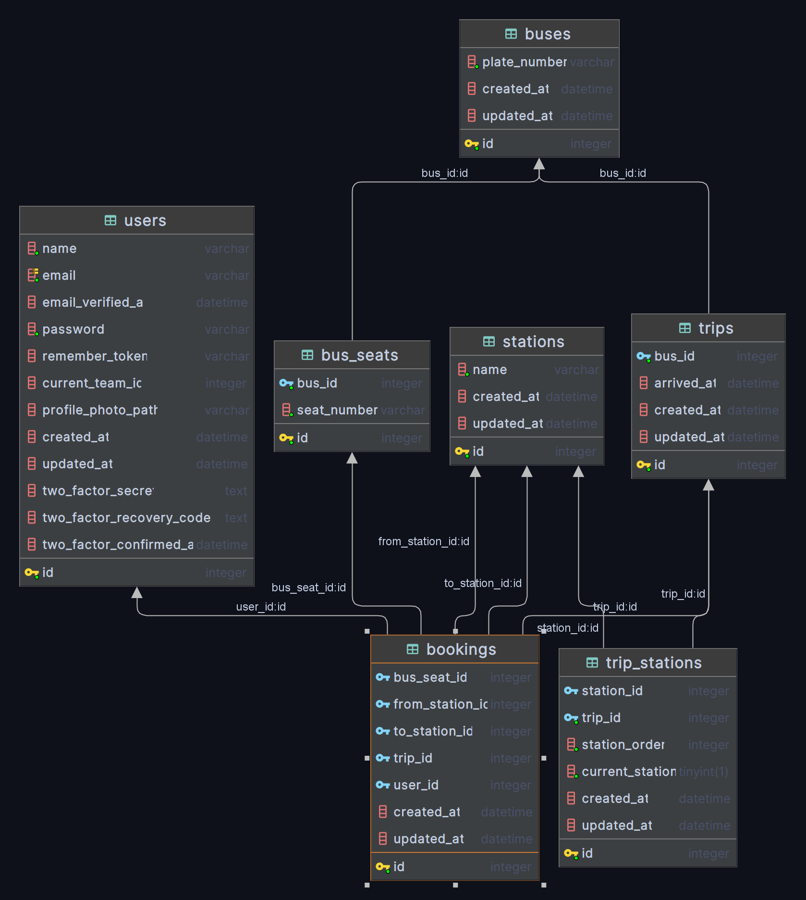

# Welcome to Fleet Management System

The goal of this project is to implement a building a fleet-management system (bus-booking system) using the latest
version of the Laravel Framework.

## Demo

Dashboard
URL : [https://robusta-fleet-management.hisham.pro/dashboard](https://robusta-fleet-management.hisham.pro/dashboard)

## Administration Area info

email:`admin@admin.com`

password:`secret`

## Requirements

1. PHP 8.1+
2. SQL Database MySQL or SQLite (preferred)

## Installation

#### 1. Clone the repository

#### 2. Copy and replace environment variables

`cp .env.example .env`

#### 3-1. Install dependencies

`composer install` or `composer update` if you will use php 8.2+

#### 3-2. Or if you want to use Docker

`docker-compose up -d` or `./vendor/bin/sail up`

#### 4. Run tests

`php artisan test`

#### 5. Run migrations and seeders

`php artisan migrate:fresh --seed`

#### 6. if you want dummy data

`php artisan db:seed DummyDataSeeder`

#### 7. Generate application key

`php artisan key:generate`

#### 8. Run the server

`php artisan serve`

## API Documentation

https://documenter.getpostman.com/view/3692137/2s9XxsWcWs

## Database Diagram

